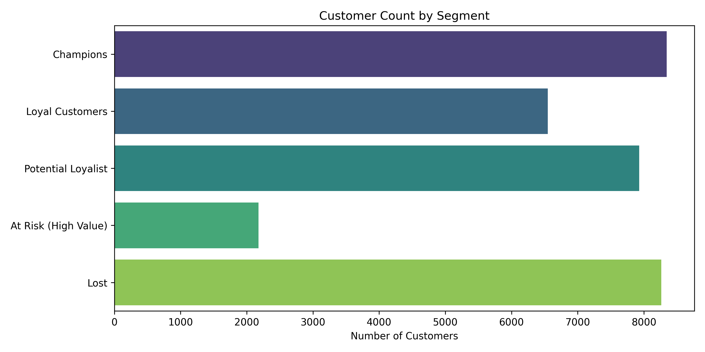

# ValueLens: Customer Segmentation & Retention Analytics



## Business Problem
The business suffers from "spray-and-pray" marketing execution. Without a data-driven understanding of customer churn risk and lifetime value, the company wastes margin by offering blanket discounts to VIPs who would buy at full price, while simultaneously burning paid retargeting budgets on permanently churned accounts. The business requires a rigorous analytical framework to identify capital exposure and deploy marketing budget with maximum incremental ROI.

## Why RFM?
Demographics (age, gender, location) do not buy products; **behavior** does. Recency, Frequency, and Monetary (RFM) analysis is a mathematically robust heuristic that evaluates exact purchasing behavior. By understanding exactly when a customer last bought, how often they buy, and how much they spend, the business can accurately diagnose the customer's lifecycle state (e.g., active, at-risk, churned).

## Key Questions
1. How deeply is the company's revenue concentrated in its top buyers?
2. Which historically valuable customers are actively slipping into churn?
3. What is the financial exposure (capital at risk) if these customers are not rescued?
4. How do we mathematically prove the ROI of a retention campaign using A/B testing?

## Dataset
The project utilizes the widely referenced **UCI Online Retail Dataset**, representing a UK-based wholesale B2B retail company spanning December 2010 through December 2011. The raw dataset contains ~541,000 transaction rows.

## Methodology
This project executes a professional end-to-end Decision Science pipeline:
1. **Data Engineering:** Automated ingestion, cleaning, and SQLite database creation.
2. **SQL Analytics:** Fast, scalable extraction of raw Recency, Frequency, and Monetary metrics.
3. **Statistical Scoring:** Percentile-based heuristic scoring (1-3 scale).
4. **Machine Learning:** Unsupervised K-Means clustering (K=4) to validate heuristic boundaries.
5. **Decision Science:** Synthesis of the data into an actionable, experiment-driven strategic framework and Markdown dashboard.

## Data Cleaning
The raw data was rigorously sanitized:
*   Dropped rows with missing `CustomerID`s (as anonymous transactions cannot be tracked longitudinally).
*   Removed cancelled orders (Invoice numbers starting with 'C').
*   Filtered out corrupted negative quantities and zero-dollar unit prices.

## SQL Analysis
Calculations were pushed down to a SQLite database (`database/valuelens.db`) to simulate a production data warehouse. 
*   **Recency:** Calculated relative to a dynamic snapshot date (`MAX(InvoiceDate) + 1 day`).
*   **Frequency:** Count of distinct `InvoiceNo` to prevent inflating frequency from multi-item single-checkout baskets.
*   **Monetary:** Sum of `Quantity * UnitPrice`.

## RFM Scoring
Customers were ranked on a strict 1-to-5 quintile scale (1 = Worst, 5 = Best) utilizing the `NTILE(5)` window function to ensure mathematically even distributions.

## Customer Segmentation
RFM strings (e.g., '333') were mapped to actionable business segments:
*   **Champions** (Recent, Frequent, High Spenders)
*   **Loyal Customers** (Consistent Repeat Buyers)
*   **Potential Loyalist** (Recent, but Low Frequency)
*   **At Risk (High Value)** (High Spenders, but Decaying Recency)
*   **Lost** (Dormant >6 Months, Low Value)

## K-Means Validation
To prevent heuristic bias, unsupervised K-Means Clustering was utilized as a secondary analytical validation layer.
*   **Preprocessing:** `np.log1p` transformation was applied to compress extreme right-skewness (B2B "whales"), followed by Z-Score Standardization.
*   **Selection:** K=4 was selected via Elbow Curve and Silhouette Score analysis.
*   **Verdict:** While K-Means successfully proved the existence of the "Lost" tail and the massive "Whale" top-tier, it fatally blurred the line between Loyal and At Risk customers by ignoring the temporal context of Recency. The heuristic RFM rules proved superior for operational marketing.

## Business Recommendations
The analytics were translated into a formal **Decision Science Framework**:
*   **Champions:** VIP treatment and early product access. *Cease all margin-eating discounts.*
*   **Lost:** Suppress from all paid retargeting lists to protect Return on Ad Spend (ROAS).
*   **At Risk:** Deploy aggressive (e.g., 30%) win-back discounts or human account manager outreach. Measure success strictly via a randomized Control Group to calculate true **Incrementality**.

## Scenario Analysis
The **"At Risk"** segment holds £545k in established revenue exposure across just 266 customers. Based on a conservative scenario model using the segment's median Average Order Value (£343), achieving a mere **5% reactivation rate** yields an estimated **£4,459** in rescued top-line revenue, completely avoiding the high Customer Acquisition Cost (CAC) of the open market.

## Key Findings
1.  **Extreme Concentration:** The Lorenz Curve proved that the Top 10% of customers are responsible for roughly 72% of all company revenue.
2.  **The "Seasonal Spiker" Fallacy:** A temporal macro-analysis revealed extreme Q4 seasonality. A static RFM model will falsely flag a Q4-only holiday buyer as "At Risk" in August. Marketing must suppress these seasonal buyers from summer win-back campaigns to protect margin.

## Technology Stack
*   **Language:** Python 3.9+
*   **Data Processing:** Pandas, NumPy
*   **Database:** SQLite3
*   **Machine Learning:** Scikit-Learn
*   **Visualization:** Matplotlib, Seaborn
*   **Testing:** Pytest

## Project Structure
```text
valuelens/
├── data/
│   ├── raw/                 # Ignored by git
│   └── processed/           # customer_360.csv and RFM outputs
├── database/                # SQLite valuelens.db
├── reports/                 # Strategic Markdown reports
│   ├── dashboard/           # Final static Markdown dashboard
│   ├── clustering/          # K-Means diagnostics
│   └── figures/             # .png visualization assets
├── sql/                     # Raw extraction queries
├── src/                     # Python execution pipeline
├── tests/                   # Pytest data quality validation suite
└── run_pipeline.py          # Root-level execution orchestrator
```

## How to Run
This project is entirely reproducible from a clean environment. Simply run the root orchestrator:

```bash
# Ensure dependencies are installed (pandas, scikit-learn, matplotlib, seaborn, pytest)
python run_pipeline.py
```
The script will automatically execute the 17-stage pipeline (skipping the 45MB download if the raw data exists), generate the SQLite database, train the K-Means cluster, calculate the statistics, and generate the final Executive Dashboard.

## Testing
The pipeline is protected by a dedicated `tests/` directory ensuring data integrity.
```bash
pytest tests/
```
The suite mathematically proves:
*   Zero missing values or duplicates in the final `customer_360.csv` dataset.
*   Perfect boundary calculations in the RFM algorithm.
*   Data type consistency.

## Limitations
This analysis utilizes a **point-in-time, cross-sectional snapshot**. While this flawlessly identifies current financial exposure, the dataset cannot mathematically prove *longitudinal* transition rates (e.g., calculating the exact probability that a new customer will become a Champion within 12 months).

## Future Improvements
To track life-cycle movement probabilistically, the business must transition from a static snapshot architecture to a **recurring monthly snapshot** model. This would unlock the ability to build **Markov Chain** transition matrices to forecast long-term segment migration and Customer Lifetime Value (LTV).
