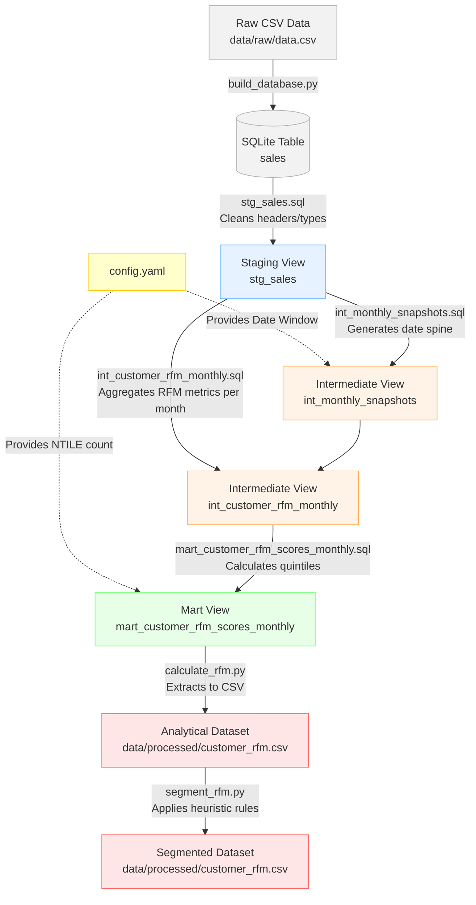

# ValueLens Data Lineage

This document outlines the data lineage of the ValueLens pipeline, specifically focusing on the longitudinal RFM snapshot architecture and heuristic segmentation.

## Lineage Diagram

## Description of Layers

1.  **Raw Layer**: Unstructured input data (`data/raw/data.csv`) is ingested and loaded as a raw SQL table in SQLite (`sales`).
2.  **Staging Layer**: The `stg_sales` view performs minimal, fundamental transformations like casting dates and ensuring column names are clean.
3.  **Intermediate Layer**: 
    *   `int_monthly_snapshots` recursively builds the time boundaries for our monthly evaluation windows, dynamically controlled by `config.yaml`.
    *   `int_customer_rfm_monthly` aggregates lifetime metrics (Recency, Frequency, Monetary) for each customer *as of* every month-end snapshot date.
4.  **Mart Layer**: `mart_customer_rfm_scores_monthly` applies `NTILE()` window functions to rank customers into quintiles (1-5 scale) against their peers at that specific point in time, producing RFM scores.
5.  **Output & Segmentation Layer**: The SQL results are extracted into a CSV format (`data/processed/customer_rfm.csv`). The `segment_rfm.py` Python script then applies business rules to assign human-readable segments (e.g., "Champions", "Lost") based on the RFM scores.
