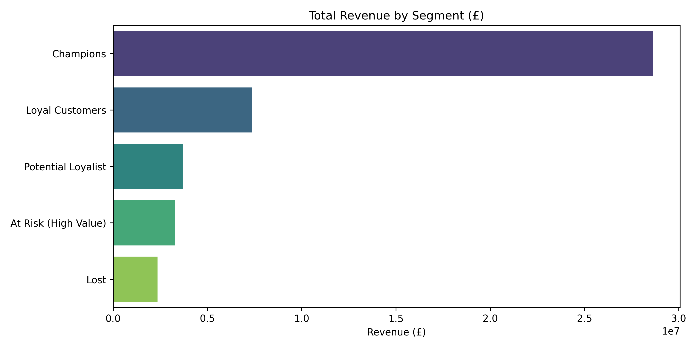
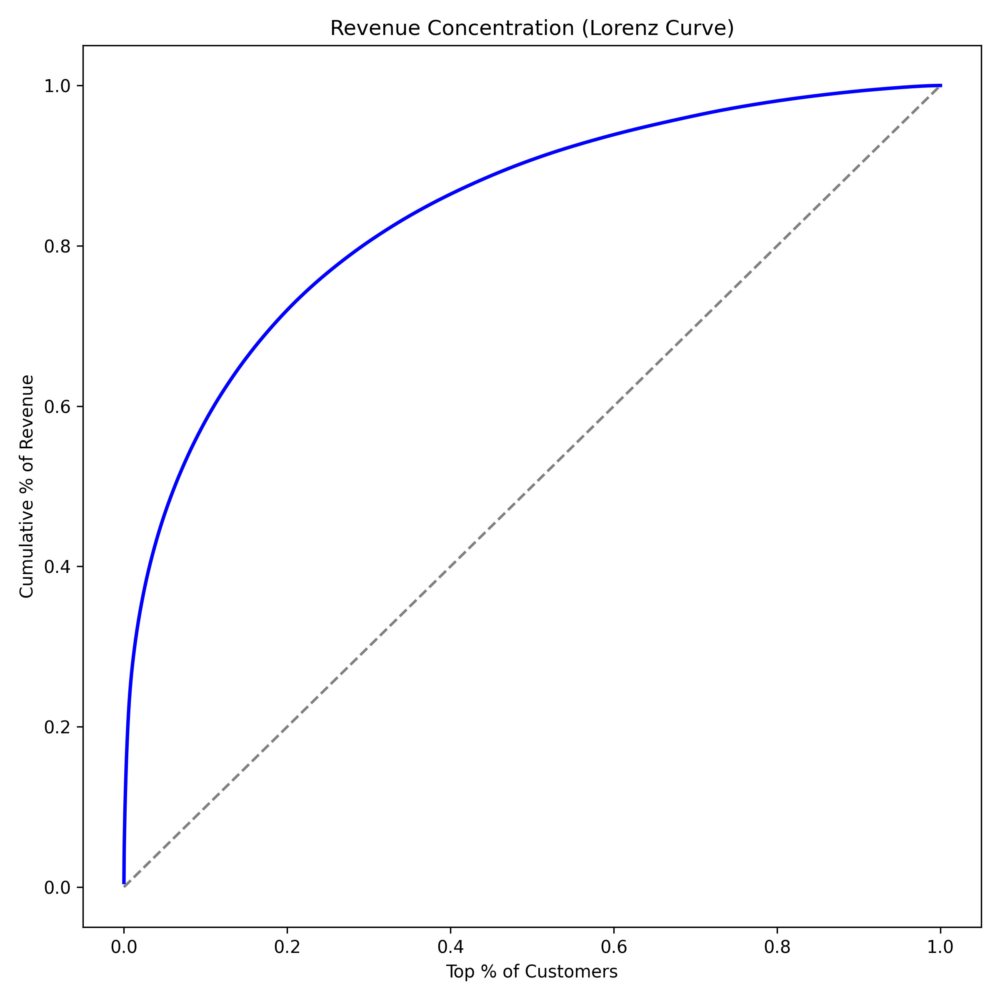
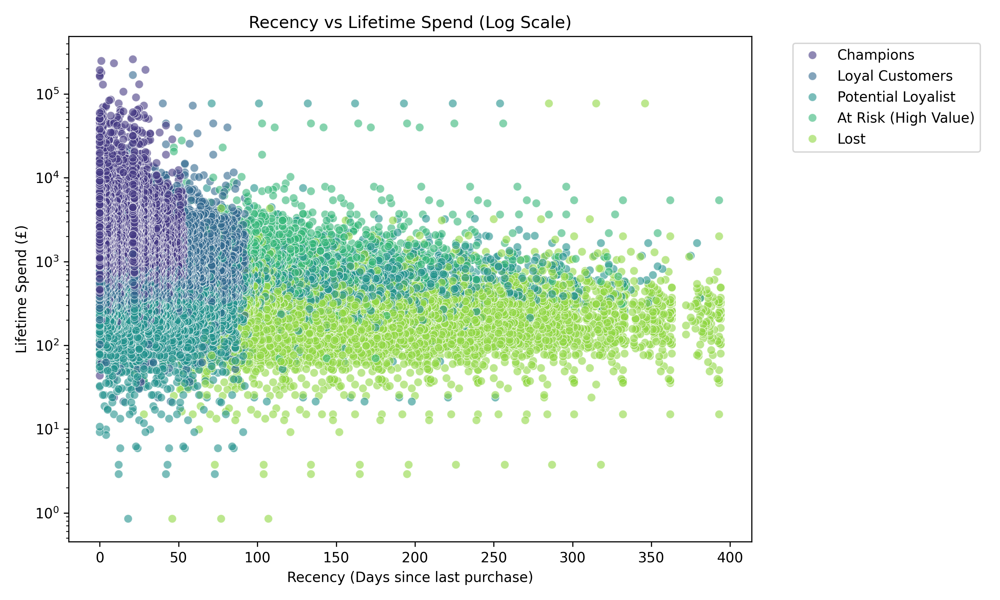
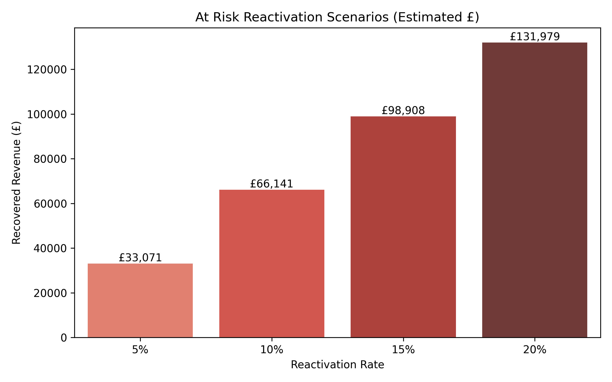

# ValueLens: Executive Analytics Dashboard

This dashboard is a lightweight, reproducible analytical report synthesized dynamically from the core ValueLens dataset.

## 1. Executive Summary (KPIs)

| Metric | Value |
| :--- | :--- |
| **Total Customers** | 33,262 |
| **Total Revenue** | £45,315,769.39 |
| **Avg Customer Value** | £1,362.39 |
| **Champions %** | 25.1% |
| **At Risk Revenue** | £3,271,560.37 |
| **Top 10% Revenue Share** | 58.2% |

---

## 2. Customer Segment Overview

We map our customer base across 5 heuristic behavioral segments based on Recency and Frequency.

---

## 3. Revenue Contribution

While "Lost" customers dominate the headcount, the "Champions" segment holds the vast majority of financial value.

---

## 4. Revenue Concentration

The Lorenz curve demonstrates our exposure. The top 10% of customers generate nearly 58% of total revenue.

---

## 5. RFM Visualization

Visualizing the correlation between high Recency (low days) and massive Lifetime Spend (Log Scale).

---

## 6. Retention Opportunity & Scenario Analysis

**Objective**: Rescue the "At Risk (High Value)" segment.
**Risk**: £3,271,560 in capital exposure.

The following model calculates the estimated top-line revenue recovered from a deep-discount win-back campaign, assuming it triggers a single transaction at the historical Median AOV of the segment. *(Note: This is a scenario analysis, not a guaranteed forecast).*

