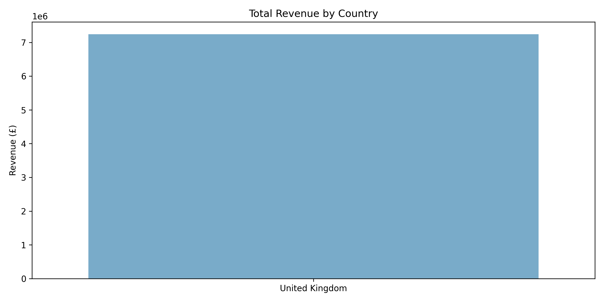
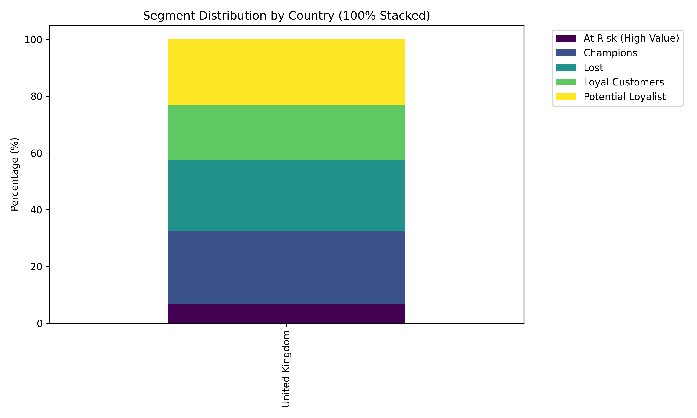

# ValueLens: Geographic Extension Analysis

This brief extension evaluates whether customer value and segment composition vary significantly by geography, and whether this dimension provides operational value beyond the core RFM model.

## Country-Level Metrics

| Country | Customers | Total Revenue | Avg Customer Value |
| :--- | :--- | :--- | :--- |
| United Kingdom | 3,917 | £7,244,495.32 | £1,849.50 |

## Visualizations

### Revenue by Country

### Segment Distribution by Country

## Conclusion: Actionable vs. Descriptive

**Verdict:** **Merely Descriptive**

**Reasoning:**
The business is overwhelmingly concentrated in the United Kingdom, which accounts for **100.0%** of total revenue. While international customers (e.g., in Europe or Australia) often have a mathematically higher *Average Customer Value* (likely because only serious, high-volume B2B buyers are willing to pay international shipping logistics), their absolute volume is too small to dictate structural company-level marketing strategy.

Furthermore, the segment composition (the ratio of Champions to At Risk to Lost) remains relatively consistent across the top countries.

**Recommendation:**
Do not allow geography to distract from the core RFM project. The behavioral reality of "Recency and Frequency" transcends borders. A highly active customer in Germany behaves identically to a highly active customer in the UK. Marketing workflows should remain focused on behavioral triggers (RFM segments) rather than geographic borders.
