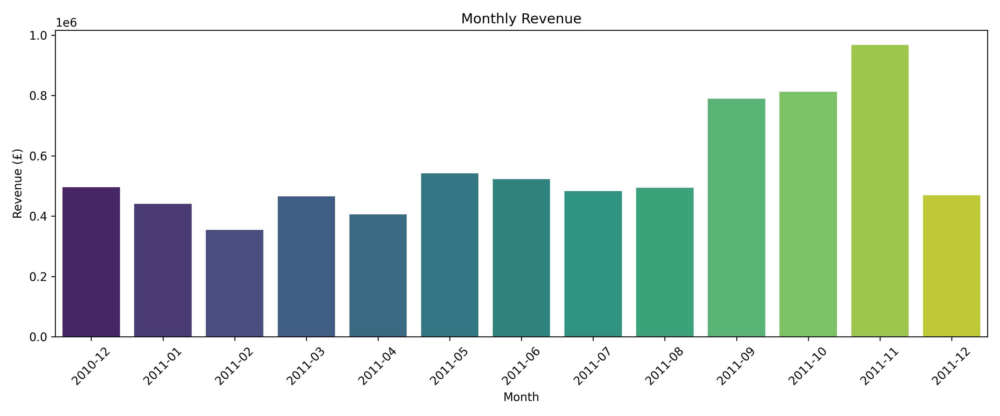
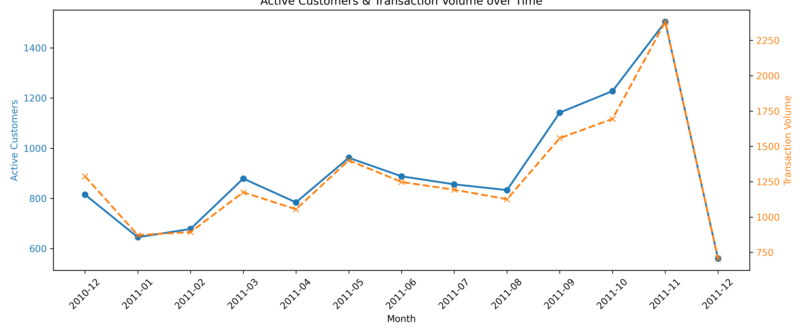
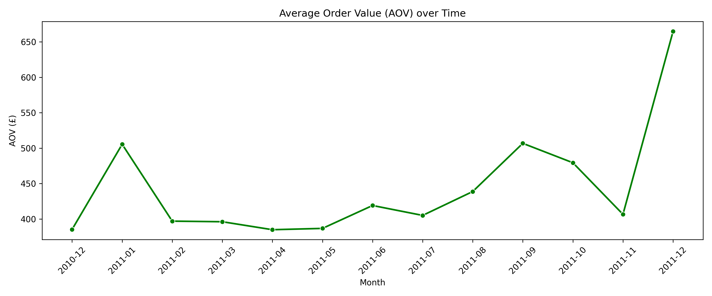

# ValueLens: Temporal & Seasonality Analysis

This extension analyzes the temporal flow of the business to identify whether macro-seasonality impacts our interpretation of the RFM models.

## Temporal Metrics Summary

| Month | Revenue (£) | Transactions | Active Customers | Avg Order Value (£) |
| :--- | :--- | :--- | :--- | :--- |
| 2010-12 | £496,234.17 | 1,288 | 815 | £385.27 |
| 2011-01 | £440,781.93 | 872 | 645 | £505.48 |
| 2011-02 | £354,513.56 | 893 | 678 | £396.99 |
| 2011-03 | £465,487.12 | 1,175 | 879 | £396.16 |
| 2011-04 | £406,069.55 | 1,055 | 784 | £384.90 |
| 2011-05 | £541,832.09 | 1,401 | 962 | £386.75 |
| 2011-06 | £523,002.46 | 1,248 | 888 | £419.07 |
| 2011-07 | £483,273.10 | 1,193 | 856 | £405.09 |
| 2011-08 | £494,084.25 | 1,126 | 833 | £438.80 |
| 2011-09 | £789,612.62 | 1,558 | 1,142 | £506.81 |
| 2011-10 | £812,146.96 | 1,694 | 1,228 | £479.43 |
| 2011-11 | £968,113.05 | 2,381 | 1,504 | £406.60 |
| 2011-12 | £469,344.46 | 706 | 560 | £664.79 |

## Visualizations

### Monthly Revenue

### Customer & Transaction Volume

### Average Order Value

## Seasonality & RFM Interpretation

**Does Seasonality Exist?**
Yes. The data explicitly shows a massive spike in Q4 (specifically November 2011). Revenue, transaction volume, and active customer counts all surge dramatically during this pre-holiday window. *(Note: December 2011 appears to drop off sharply only because the dataset natively truncates in early December).*

**How Seasonality Affects RFM:**
The existence of extreme Q4 seasonality introduces a critical risk to RFM interpretation, particularly concerning the **"At Risk"** and **"Lost"** segments.

1.  **The "Seasonal Spiker" Fallacy:** 
    A customer who buys exclusively in November for holiday gifting will naturally show a deeply decayed Recency score (e.g., >250 days) by the following August. 
2.  **Misdiagnosis:**
    An unadjusted RFM model will flag this customer as "At Risk" or "Lost" because they haven't purchased in 9 months. However, they are not actually churning; they are simply waiting for their seasonal purchasing window (Q4) to reopen. 

**Recommendation:**
While our cross-sectional RFM snapshot is highly effective, the business should not deploy aggressive "Win-Back" margin discounts to customers who historically *only* buy in Q4. Before sending a 30% discount to an "At Risk" customer in August, we must check their historical invoice dates to ensure we aren't subsidizing a seasonal buyer who would organically return in November regardless.
